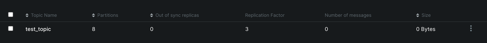
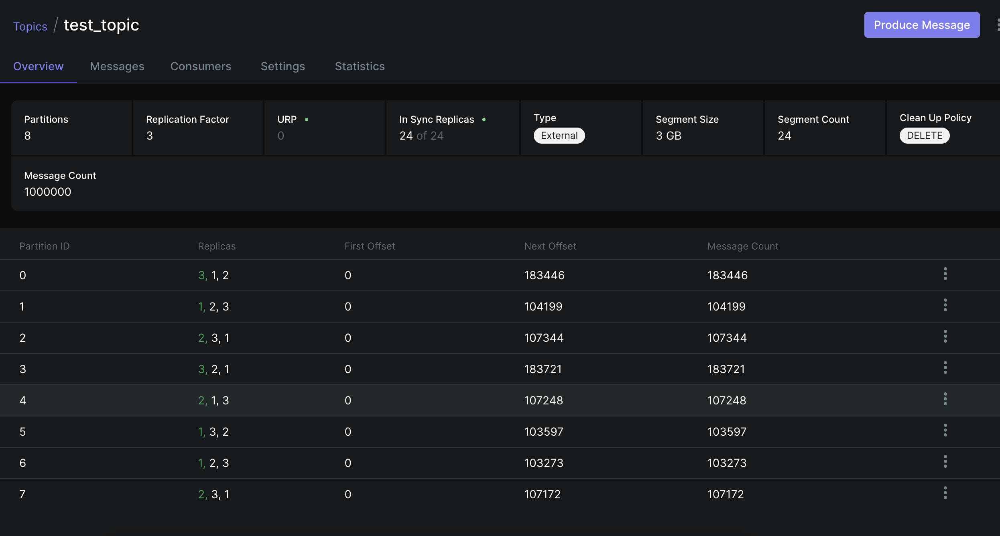
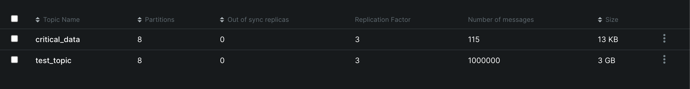
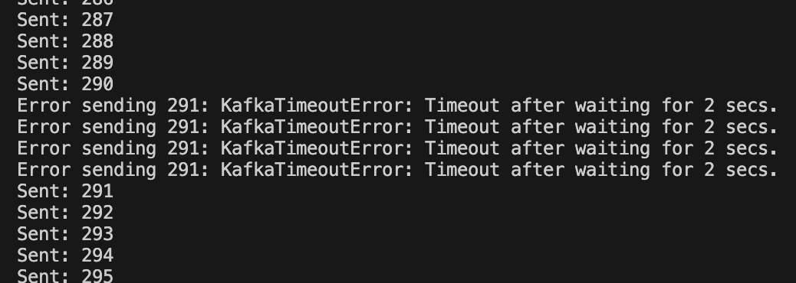
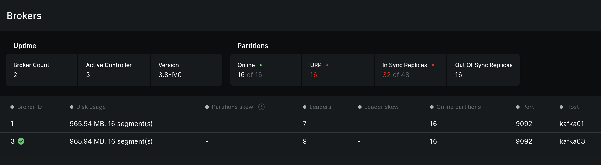
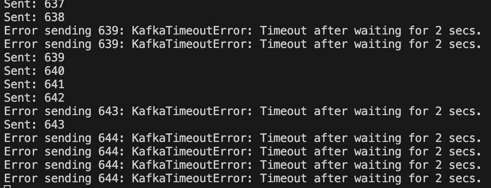
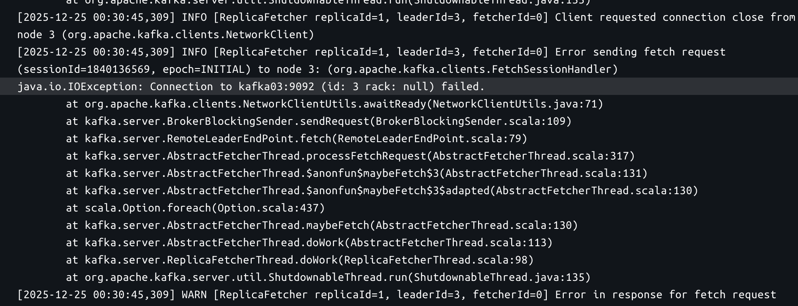

Кластер жив и здоров


Раздел topics



Топик


### Характеристики топика

Фактор репликации = 3

Сообщение имеет еще 2 копии, если брокер выходит из строя, остается доступная копия.

8 партиций

События с одним ключом находятся в одной партиции в порядке добавления. Если бы было меньше партиций, был бы меньше параллелизм, все бы сообщения шли бы через нее. Еще есть столбец Partition skew - если в какой партиции есть перекос, это влечет неравномерную нагрузку.

Количество лидеров между брокерами было распределенно примерно равномерно (3, 3, 2). Если убить одного брокера, лидеры перераспределятся и кластер продолжит работу.

### После нагрузочного тестирования


Сообщения появились на всех брокерах, по партициям равномерное распределение.


``` 1000000 records sent, 151791.1 records/sec (144.76 MB/sec), 126.24 ms avg latency, 835.00 ms max latency, 67 ms 50th, 405 ms 95th, 689 ms 99th, 811 ms 99.9th. ```

### Отказоусточивость




Появился новый топик, сообщения отправляются

Убили контроллер, сообщение какое-то время не отправлялось. Какие то реплики стали не доступны




Убили еще один контроллер



Появились сообщения с таймаутами, топик в UI недоступен. ISR показывает 32/48 - количество доступных реплик.

Логи последнего контроллера. Судя по логам он хочет реплицировать сообщение, но он остался 1 и не может соединиться с другим брокером. 



После восстановления сообщения продолжили отправляться и реплицироваться.
Но они не так равномерно распределены. Также в UI показывается чуть больше сообщений чем в стрелялке на Питоне.

