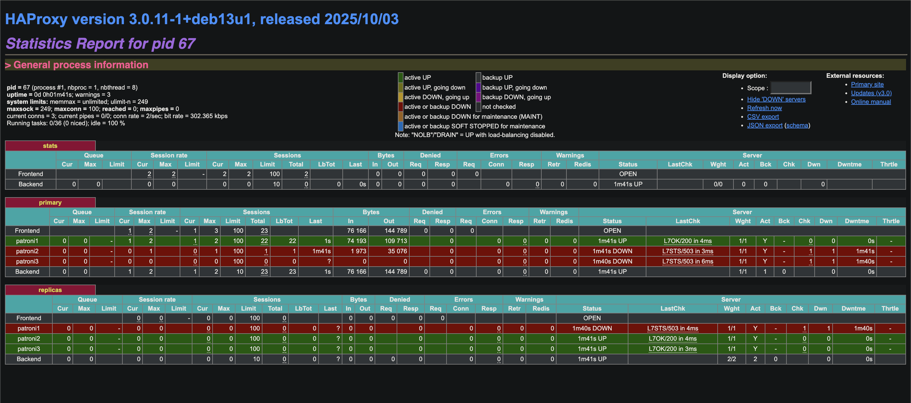

Посмотрим список нод, их роль и состояние
$ patronictl list
```
+ Cluster: demo (7587516495256621079) --------+----+-------------+-----+------------+-----+
| Member   | Host       | Role    | State     | TL | Receive LSN | Lag | Replay LSN | Lag |
+----------+------------+---------+-----------+----+-------------+-----+------------+-----+
| patroni1 | 172.23.0.4 | Leader  | running   |  1 |             |     |            |     |
| patroni2 | 172.23.0.9 | Replica | streaming |  1 |   0/4000060 |   0 |  0/4000060 |   0 |
| patroni3 | 172.23.0.5 | Replica | streaming |  1 |   0/4000060 |   0 |  0/4000060 |   0 |
+----------+------------+---------+-----------+----+-------------+-----+------------+-----+
```



HAProxy показывает состояние сервисов. Sessions показывает 2 созданные сессии. В Bytes сумма отправленных байтов между клиентами и HAProxy. HAProxy показывает статусы лидера (patroni1) и реплики (patroni2, patroni3).

Данные пишутся в primary-ноду, в другие ноды postgres писать не дает. 

Откуда читается - здравый смысл говорит, что чтение должно происходить с реплики (иначе странно было бы, если бы реплики лежали без дела). Однако смущает, что в отчете HAProxy 0 байтов во вкладке Bytes в репликах, только в Primary. 


Примеры логов стрелялки
```
[00:56:15] INSERT: logout by Мария Сидорова
[00:56:16] INSERT: logout by Алексей Козлов
READ check (Last 3 IDs): [818, 817, 816]
[00:56:17] INSERT: logout by Алексей Козлов
[00:56:18] INSERT: purchase by Иван Петров
READ check (Last 3 IDs): [820, 819, 818]
```

Пример с потерей соединения
```
[00:52:17] INSERT: logout by Алексей Козлов
[00:52:18] INSERT: purchase by Мария Сидорова
READ check (Last 3 IDs): [691, 690, 689]
[00:52:19] INSERT: purchase by Алексей Козлов

[00:52:20] CONNECTION LOST (Failover in progress?): terminating connection due to administrator command
server closed the connection unexpectedly
        This probably means the server terminated abnormally
        before or while processing the request.

[00:52:25] Connection failed: connection to server at "localhost" (::1), port 5002 failed: server closed the connection unexpectedly
        This probably means the server terminated abnormally
        before or while processing the request.


[00:52:26] CONNECTED to Master Node
[00:52:26] INSERT: error by Иван Петров
READ check (Last 3 IDs): [717, 692, 691]
```

Когда я отключал etcd - ничего не происходило. Когда отключал реплики, также ничего не происходило. Когда отключал мастер-ноду с patroni была временная недоступность, и лидерство брала другая нода. Если отключить все реплики и мастер-ноду, сервис был полностью недоступен. Также полностью была недоступность при отключении haproxy, и она становится своего рода SPOF.
Чтобы такого избежать, возможно в продакшене у haproxy тоже есть что-то вроде запасной ноды, на случай, если упадет основная.
